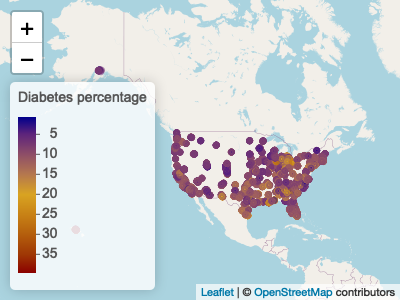
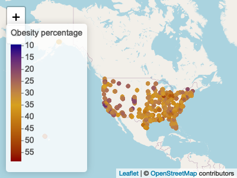
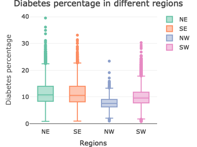
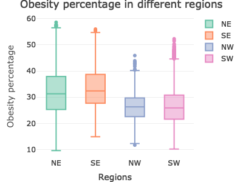
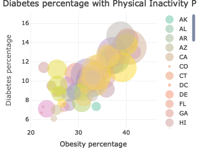

PM566 Final Project
================
Sam (Cheng-Hsiang) Lu
2022-11-29

toc: TRUE toc_float: TRUE

 

# **Introduction**

I download two datasets which are talking about “diagnosed diabetes
among adults aged \>=18 years” and “Obesity among adults aged \>=18
years” in the US in 2017 from the CDC. They include estimates for the
500 largest US cities and approximately 28,000 census tracts within
these cities. I also download one dataset which is the “Prevalence of
Self-Reported Physical Inactivity Among US Adults by State and
Territory, 2017–2020”.

 

# **Methods**

## Read in the data by API

I used API method to obtain my datasets from CDC. First, you have to
create an account with password. Then, you have to apply for a free app
token. Last, copy your API Endpoint. Both datasets contain 27 columns
and 29,006 rows. Here are my datasets links:
`https://chronicdata.cdc.gov/500-Cities-Places/500-Cities-Obesity-among-adults-aged-18-years/bjvu-3y7d`
`https://chronicdata.cdc.gov/500-Cities-Places/500-Cities-Diagnosed-diabetes-among-adults-aged-18/cn78-b9bj`

 

The Physical Inactivity dataset contains 3 columns and 53 rows. This is
the URL to download it:
`https://www.cdc.gov/physicalactivity/data/inactivity-prevalence-maps/tables/2020/1-self-reported.csv`

 

## Select columns

From CDC datasets, I select **data_value(%), populationCount, stateabbr,
statedesc(state name), city_name, geolocation.latitude, and
geolocation.longitude** total 7 columns. From the Physical Inactivity
dataset, I select **state and prevalence** 2 columns.

 

## Change column names and state names

I change my column names in order to easily understand.

 

## Remove non-numeric value

This step, I remove the physical inactivity prevalence non-numeric value
in the Physical Inactivity dataset.

 

## Merge two datasets

Merge CDC two datasets by **state_abbr, populationCount, state_name,
city_name, lat, and lon**. Then I merge the Physical Inactivity dataset
with them.

## Remove duplicates

    ## [1] 30008     9

My row number increased to 30,008 so I have to remove duplicates.

    ## [1] 28505     9

After removing duplicates, my rows shrink from 30,008 to 28,505.

 

## Convert chr into num

In this step, I just want to convert character variables into numeric
variables.

 

## Check NAs

There are only 2.7% NAs in my dataset which are not significant.
Therefore, I’m going to remove NA values

    ## [1] 0.02785476

    ## [1] 0.02785476

 

## Add regions

I create a new column contain Northeast, Northwest, Southwest, and
Southeast four different regions

 

# **Results**

## Leaflet

### Diabetes percentage in the US

### Obesity percentage in the US

## 

From the Leaflet, the legend shows the degree of the diabetes
percentage. The red color means higher percentage of diabetes. I see
there are more orange dots in the NE region and SE region from the plot
of diabetes percentage. From the second plot of obesity percentage, we
can see that there are more orange dots on the east-side than on the
west-side.

 

## Boxplots

### Diabetes percentage

### Obesity percentage

## 

Now, let see the boxplot, the x-axis shows 4 regions: Northeast,
Southeast, Northwest, and Southwest. On the y-axis shows the percentage
of diabetes or obesity.

From the boxplot of diabetes percentage, there is a max diabetes
percentage in the NE region, and the NE region and the SE region have a
similar median diabetes percentage. The NW region has the lowest median
diabetes percentage. In this plot, the east-side regions’ median
diabetes percentage is higher than the west-side regions’.

From the boxplot of obesity percentage, the east-side regions’ median
obesity percentage is also higher than the west-side regions’. Among all
regions, the SE region has the highest median obesity percentage and the
SW region has the lowest median obesity percentage.

 

## Scatter plots

In this scatter plot, I select each state’s median of obesity percentage
and diabetes percentage with their physical inactivity prevalence. We
can see that there is a positive correlation between obesity and
diabetes rates. We can also see the physical inactivity prevalence by
the size of dots. I cannot tell the direct correlation with the obesity
or diabetes rates. However, it looks like there are bigger dots on the
top right corner and smaller dots on the bottom left corner.

 

# **Conclusion**

## Question 1: How are the distribution of diabetes and obesity percentages in the US?

From the leaflet, first we can see there are more orange dots on the NE
and SE regions. From the box plot, the median of diabetes percentage
looks equally high in the NE and SE regions. The median of obesity
percentage looks higher in the SE region than in the NE region. Besides,
we can also see there are higher diabetes and obesity percentages on the
east-side than on the west-side.

## Question 2: Is there any correlation between diabetes and obesity? If so, is there any correlation with physical inactivity prevalence?

From the scatter plot, we can see that there is a positive correlation
between obesity and diabetes rates by states. As for the correlation
with physical inactivity prevalence, I don’t see a strong correlation
with physical inactivity prevalence. However, I can tell that smaller
dots are on the bottom left corner and bigger dots are on the top right
corner.

 

# **Discussion**

I would like to add more variables to my dataset in order to make more
interesting plots. For example, I want to add different years and time
to check if there are any changes of diabetes and obesity percentages in
each state. Adding each state’s median income level , average education
level, and so on, to see whether diabetes and obesity percentages would
be affected by them.
